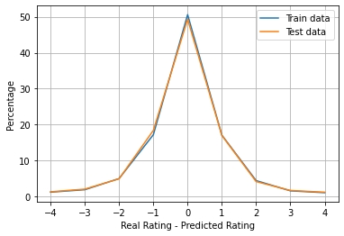
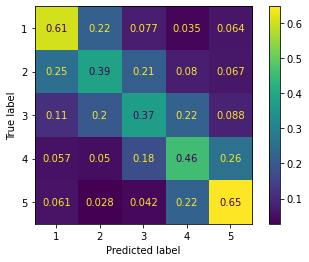

# Predicting review numeric ratings based exclusively on the text of the review

Given a text review, ¿can we guess, from 1 to 5 stars, which is the score of the review? We certainly can estimate it roughly.

I downloaded from the [Amazon Review Data (2018)](https://nijianmo.github.io/amazon/index.html) the small book subset to perform this exercise. I created a MongoDB collection for this dataset and designed an exercise for learning purposes.

The objective then is, converting each review to [TF-IDF vectors](https://towardsdatascience.com/tf-idf-for-document-ranking-from-scratch-in-python-on-real-world-dataset-796d339a4089) and to use a Machine Learning algorithm using these features to predict the numeric rating of the review.

## Simple model using Logistic Regression

The "small" book review dataset consists of 27,164,983 reviews. Stored it in a MongoDB collection, and using `pymongo` I loaded a random subset of 60,000 reviews. This is because I am working with a laptop and hence I can't work with massive datasets.

The text of the review is cleaned removing punctuation and stopwords. Then I obtain the TF-IDF vectors for each review. By simply applying the Logistic Regression model, we obtain fairly good results:

The confusion matrix of the test sample (normalized to the true ratings):

This is just a quick and very simplistic approach that certainly can be improved (reduce dimensionality, test more models, change hyperparameters...), but very useful to understand and learn the possibilities of this exercise.